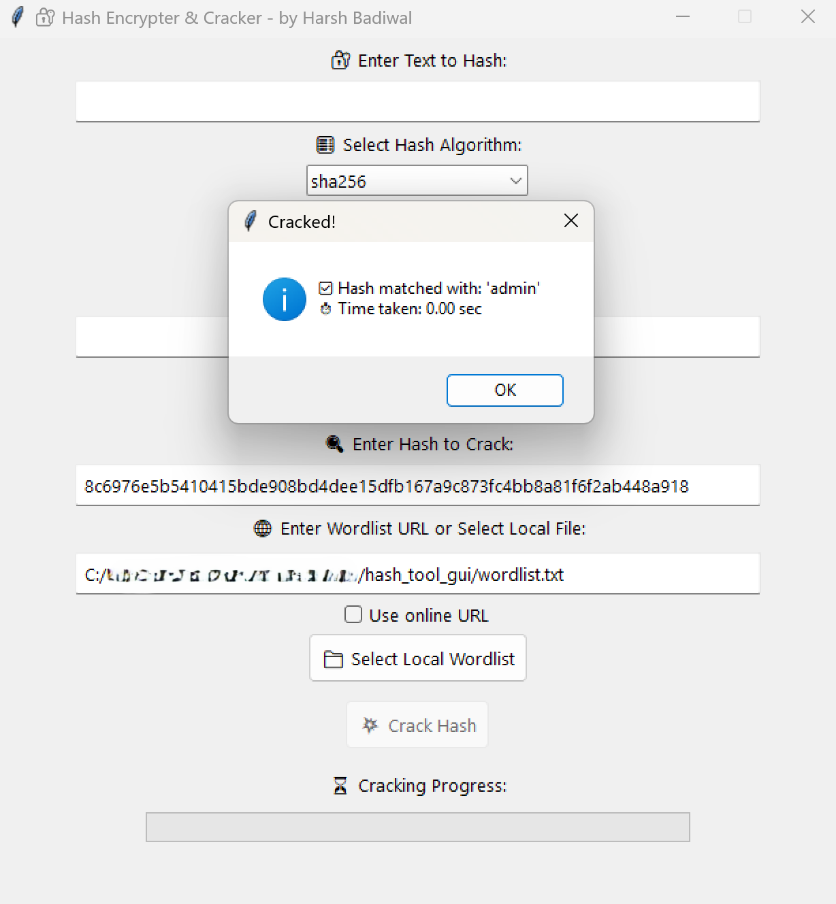
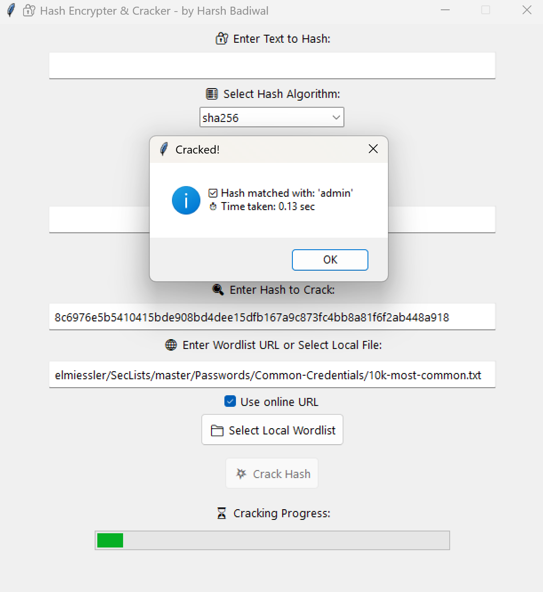

# 🔐 Hash Encrypter & Cracker Tool

A powerful Python GUI application built using **Tkinter** that allows you to:

- Generate hash values (MD5, SHA1, SHA256, SHA512)
- Match and validate hashes
- Crack hash values using a local or online wordlist (dictionary attack)
- View cracking progress in real-time
- Save results to file with algorithm info

> Built by **Harsh Badiwal**, Security Engineer 🛡️

---

## 🖼️ Screenshot

---

## 🚀 Features

✔️ Easy-to-use GUI  
✔️ Built-in support for popular hash algorithms  
✔️ Real-time progress bar  
✔️ Crack using **local file** or **online wordlist URL**  
✔️ Saves cracked hashes in `cracked_results.txt`  
✔️ No external libraries needed (Tkinter + hashlib)

---

## 🧠 How it Works

🔹 **Hash Generator:** Input text + select algorithm = hash output  
🔹 **Validator:** Check if input string matches a given hash  
🔹 **Cracker:** Load wordlist → compare each word’s hash with the target → return match

---

## 📦 Installation & Setup

### 🔧 Requirements
- Python 3.7+
- Tkinter (comes pre-installed with Python)
- Internet (only for online wordlist cracking)

## 🧑‍💻 Author 
 
 Harsh Badiwal || Security Engineer
 
 
 
 
